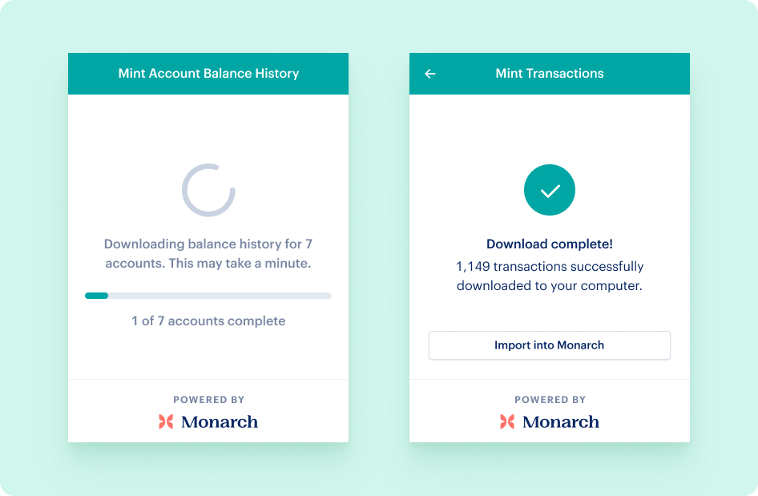

<h3>Mint Data Exporter, by Monarch Money</h3>

> Effortlessly export your Mint data to CSV.

## Features
* Download your daily balances for all accounts
* Download all of your transactions

## Installation

### Chrome Web Store
https://chromewebstore.google.com/detail/mint-data-exporter-by-mon/doknkjpaacjheilodaibfpimamfgfhap?hl=en&pli=1

### From Source
1. Clone the repository
2. Run `pnpm install`
3. Run `pnpm build`
4. Open Chrome and navigate to `chrome://extensions`
5. Enable developer mode
6. Click on "Load unpacked" and select the `dist` folder

## Contributing
Contributions are welcome! Please read our [contributing guidelines](CONTRIBUTING.md) for more information.

## Licensing Information
This project is based on [chrome-extension-boilerplate-react-vite](https://github.com/Jonghakseo/chrome-extension-boilerplate-react-vite) which is licensed under the MIT License (see `LICENSE`). Our modifications and additional code are licensed under the GNU General Public License (GPL), which is detailed in `LICENSE-GPL`.

## Usage

1. Install the extension (see above).
2. Head to https://mint.intuit.com and log in to your Mint account.
3. Click the extension button to get started.

## FAQ

### What does this do?
This is a Chrome extension that lets you export all of your data from Mint, since [Intuit has announced that Mint “will go away”](https://support.creditkarma.com/s/article/Intuit-Mint-and-Credit-Karma). You could use this if you want to move to another an alternative, like Monarch Money, or if you simply want to preserve your data history.

### Why use this tool? Can’t I export things manually?

You *could* export things manually instead, but as users have moved from Mint to Monarch, we’ve seen a lot of quirks with Mint’s exports. This tool helps address some of these quirks:

- **Export more than 10,000 transactions.** By default, when exporting transactions, Mint will only export the first 10,000 transactions (this isn’t always clear, you’ll just end up with missing transactions in your export and may not notice). You could filter your transactions and do several exports, but that’s tedious. This tool will issue as many requests as possible, and then merge the results into one final file that should have ***all*** your transactions (not just 10,000).
- **Export all individual account balances.** When exporting historical account balances from Mint, you can only export one account at a time. This tool will loop through all the accounts you select, and export each one, saving you the manual work of doing that repetitively for each account.
- **Export daily balances for your accounts.** When exporting historical account balances, Mint will only export the monthly balance (unless you filter to within a given month). This tool will loop through and export daily balances.

### Is this free?
Yes.

### Is it secure?
This tool does everything locally. Your data is not sent anywhere. It will re-use an API key from a local, logged in session to mint.intuit.com. It won’t store anything remotely or send data anywhere else. All data downloaded will be stored locally for you so you can decide what you do with it.

### Can I use this without Monarch Money?
Absolutely! This tool simply exports all your data and saves them locally. It doesn’t send anything to Monarch Money and it doesn’t require you to have a Monarch Money account. You could later import those files to Monarch Money or to any other tool, but you don’t have to. We'd recommend downloading your data before Mint goes away even if you don't know what tool you will use next.

### Can I use this _with_ Monarch Money?
Yes! Check [this guide](https://help.monarchmoney.com/hc/en-us/articles/4411877901972-Move-data-over-from-Mint-to-Monarch).
